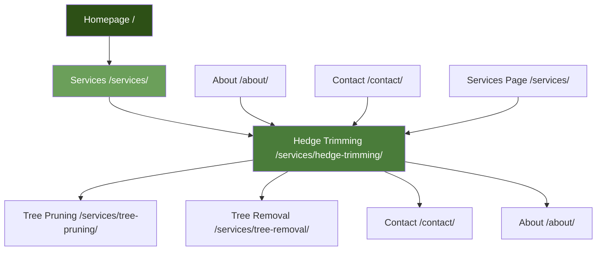

# Hedge Trimming SEO: Link Plans, Metadata & Technical Deliverables

## SECTION B: INTERNAL & EXTERNAL LINK PLAN

### Required Links in Draft Body

**Homepage Links (Minimum 1):**
- Location: After "Why Professional Hedge Trimming Matters" section
- Anchor Variants: "The Green Barber homepage", "our professional garden services", "comprehensive tree and garden care"
- Rationale: Establish brand connection, support site navigation

**Internal Page Links (Minimum 1):**
- To: `/services/tree-pruning/`
- Location: In "Hedge Species and Care" section
- Anchor Variants: "professional tree pruning services", "tree pruning and care", "certified tree pruning"
- Rationale: Related service, natural content flow

- To: `/services/tree-removal/`
- Location: In "Hedge Reduction and Restoration" section
- Anchor Variants: "tree removal services", "professional tree removal", "tree care services"
- Rationale: Related service, service cross-link

- To: `/contact/`
- Location: In "Hedge Trimming Cost" section and FAQ section
- Anchor Variants: "contact us for a quote", "get your free quote", "request consultation"
- Rationale: Conversion CTA

- To: `/about/`
- Location: In "Service Areas" section
- Anchor Variants: "learn about our local expertise", "our Southern Tasmania service", "local arborist team"
- Rationale: About page link

**External Authoritative Links (Minimum 1):**
- To: `https://www.rhs.org.uk/` (Royal Horticultural Society)
- Location: In "Hedge Species and Care" section
- Anchor Variants: "Royal Horticultural Society", "hedge care guidelines", "professional horticultural standards"
- Rationale: Authority citation, horticultural expertise

- To: `https://www.gardeningaustralia.com.au/` (Gardening Australia)
- Location: In "When to Trim Hedges" section
- Anchor Variants: "Gardening Australia", "Australian garden care advice", "local gardening resources"
- Rationale: Local authority reference, Australian gardening expertise

### Link Placement Table

| FROM Section | TO Page | Anchor Variant 1 | Anchor Variant 2 | Anchor Variant 3 | Rationale |
|-------------|---------|------------------|------------------|------------------|-----------|
| Why Professional Hedge Trimming Matters | `/` | The Green Barber homepage | our professional garden services | comprehensive tree and garden care | Brand connection |
| Hedge Species and Care | `/services/tree-pruning/` | professional tree pruning services | tree pruning and care | certified tree pruning | Related service |
| Hedge Reduction and Restoration | `/services/tree-removal/` | tree removal services | professional tree removal | tree care services | Service cross-link |
| Hedge Trimming Cost | `/contact/` | contact us for a quote | get your free quote | request consultation | Conversion CTA |
| Service Areas | `/about/` | learn about our local expertise | our Southern Tasmania service | local arborist team | About page link |
| Hedge Species and Care | `https://www.rhs.org.uk/` | Royal Horticultural Society | hedge care guidelines | professional horticultural standards | Authority citation |
| When to Trim Hedges | `https://www.gardeningaustralia.com.au/` | Gardening Australia | Australian garden care advice | local gardening resources | Local authority reference |
| FAQ Section | `/contact/` | contact us for a quote | get your free quote | schedule hedge trimming | Conversion CTA |

### Section-Level Contextual Placements

**Introduction Section:**
- No links (establishing authority)

**Why Professional Hedge Trimming Matters:**
- Link to homepage (mid-section)

**Comprehensive Solutions:**
- No links (service descriptions)

**Hedge Trimming Process:**
- No links (process explanation)

**Hedge Trimming Cost:**
- Link to contact page (CTA)

**When to Trim Hedges:**
- Link to Gardening Australia (authority reference)

**Residential vs Commercial:**
- No links (comparison content)

**Hedge Species and Care:**
- Link to tree pruning service
- Link to RHS (authority citation)

**Ongoing Maintenance Programs:**
- No links (service feature)

**Service Areas:**
- Link to about page

**FAQ:**
- Link to contact page (multiple CTAs)

---

## SECTION C: LINK QUOTAS, READABILITY & DEPTH CONTROL

### Link Quotas Per Page

**Total Internal Links:** 5
- Outbound to homepage: 1
- Outbound to other inner pages: 4 (tree pruning, tree removal, contact, about)
- Inbound expected from: Homepage, Services page, About page, Contact page

**Total External Links:** 2
- Royal Horticultural Society: 1
- Gardening Australia: 1

**Readability Target:** 8-10th grade (Flesch Reading Ease: 60-70)
- Current draft uses clear, professional language
- Short paragraphs (3-4 sentences)
- Active voice preferred
- Technical terms explained

**Crawl Depth Control:**
- Homepage → Hedge Trimming: Depth 1 ✓
- Services → Hedge Trimming: Depth 2 ✓
- About → Hedge Trimming: Depth 2 ✓
- Contact → Hedge Trimming: Depth 2 ✓
- Maximum depth: 2 (within limit of ≤3)

**Breadcrumb Path:**
- Home → Services → Hedge Trimming Services
- Path: `/` → `/services/` → `/services/hedge-trimming/`

**Orphan Prevention:**
- Hedge Trimming links to: Tree Pruning, Tree Removal, Contact, About, Homepage
- Ensure these pages link back to Hedge Trimming
- Add Hedge Trimming to Services page navigation
- Include in homepage service section

---

## SECTION D: CANNIBALIZATION & DUPLICATION CHECK

### Potential Cannibalization Risks

**Query-to-URL Mapping:**

| Query | Primary URL | Risk Level | Resolution |
|-------|-------------|------------|------------|
| "hedge trimming Hobart" | `/services/hedge-trimming/` | Low | Primary target |
| "hedge maintenance" | `/services/hedge-trimming/` | Low | Primary target |
| "hedge cutting service" | `/services/hedge-trimming/` | Low | Covered in content |
| "garden hedge trimming" | `/services/hedge-trimming/` | Low | Covered in content |
| "hedge shaping Hobart" | `/services/hedge-trimming/` | Low | Covered in section |
| "residential hedge trimming" | `/services/hedge-trimming/` | Low | Covered in section |
| "commercial hedge trimming" | `/services/hedge-trimming/` | Low | Covered in section |
| "garden maintenance Hobart" | `/services/hedge-trimming/` | Medium | Primary focus on hedge trimming, but garden maintenance mentioned |
| "hedge pruning" | `/services/hedge-trimming/` | Low | Covered in content, differentiated from trimming |
| "hedge trimming cost Tasmania" | `/services/hedge-trimming/` | Low | Covered in pricing section |

**Near-Duplicate Targets:**

1. **Garden Maintenance vs Hedge Trimming**
   - Risk: "Garden maintenance" queries might compete
   - Resolution: Hedge trimming is primary focus, garden maintenance mentioned as related but not primary
   - Monitor: If garden maintenance queries grow significantly, consider separate page

2. **Hedge Pruning vs Hedge Trimming**
   - Risk: Pruning queries might overlap
   - Resolution: Content clearly differentiates trimming (appearance) vs pruning (health/structure)
   - Current: Appropriate differentiation

3. **Residential vs Commercial**
   - Risk: Separate queries for residential/commercial
   - Resolution: Both covered in single page with clear section differentiation
   - Current: Appropriate coverage

**Cannibalization Prevention:**
- Use consistent primary keyword per page
- Avoid exact keyword repetition across pages
- Use semantic variants appropriately
- Monitor search console for keyword cannibalization signals

---

## SECTION E: DEV-HANDOFF JSON

```json
{
  "url": "/services/hedge-trimming/",
  "title": "Professional Hedge Trimming Services in Hobart | Expert Garden Maintenance",
  "meta_description": "Expert hedge trimming services in Hobart by certified arborists. Precision trimming for residential and commercial properties. Free quotes available.",
  "h1": "Professional Hedge Trimming Services in Hobart | Expert Garden Maintenance",
  "h2": [
    "Why Professional Hedge Trimming Matters for Your Hobart Property",
    "Comprehensive Hedge Trimming Solutions We Offer",
    "The Hedge Trimming Process: Precision and Care",
    "Hedge Trimming Cost in Tasmania: Transparent Pricing",
    "When to Trim Hedges: Timing and Frequency for Hobart Gardens",
    "Residential vs Commercial Hedge Trimming: Understanding Your Needs",
    "Hedge Species and Care: Tailored Approaches for Hobart Gardens",
    "Ongoing Hedge Maintenance Programs: Keep Your Hedges Perfect Year-Round",
    "Service Areas: Hedge Trimming Throughout Hobart and Surrounding Suburbs",
    "Frequently Asked Questions About Hedge Trimming in Hobart"
  ],
  "h3_map": {
    "Why Professional Hedge Trimming Matters for Your Hobart Property": [
      "Enhanced Property Aesthetics and Curb Appeal",
      "Healthy Hedge Growth and Longevity",
      "Time and Effort Savings",
      "Precision and Consistency"
    ],
    "Comprehensive Hedge Trimming Solutions We Offer": [
      "Residential Hedge Trimming",
      "Commercial Hedge Trimming",
      "Formal Hedge Shaping and Topiary",
      "Hedge Reduction and Restoration",
      "Boundary and Privacy Hedge Maintenance"
    ],
    "The Hedge Trimming Process: Precision and Care": [
      "Step 1: Initial Assessment and Consultation",
      "Step 2: Trimming Plan Development",
      "Step 3: Site Preparation and Protection",
      "Step 4: Precision Trimming Execution",
      "Step 5: Shaping and Detail Work",
      "Step 6: Cleanup and Debris Removal",
      "Step 7: Maintenance Recommendations"
    ],
    "Hedge Trimming Cost in Tasmania: Transparent Pricing": [
      "Primary Cost Factors",
      "Hedge Species and Complexity",
      "Service Frequency and Programs",
      "Transparent Pricing and Free Quotes"
    ],
    "When to Trim Hedges: Timing and Frequency for Hobart Gardens": [
      "Seasonal Trimming Considerations",
      "Growth Rate and Frequency",
      "Hobart Climate Considerations",
      "Avoiding Stress Periods"
    ],
    "Residential vs Commercial Hedge Trimming: Understanding Your Needs": [
      "Residential Hedge Trimming Characteristics",
      "Commercial Hedge Trimming Characteristics",
      "Scale and Complexity Differences",
      "Maintenance Program Differences"
    ],
    "Hedge Species and Care: Tailored Approaches for Hobart Gardens": [
      "Common Hobart Hedge Species",
      "Species-Specific Trimming Techniques",
      "Climate Adaptation Considerations",
      "Native Species Expertise"
    ],
    "Ongoing Hedge Maintenance Programs: Keep Your Hedges Perfect Year-Round": [
      "Regular Maintenance Benefits",
      "Customized Maintenance Schedules",
      "Cost Efficiency and Predictability",
      "Convenience and Time Savings"
    ],
    "Service Areas: Hedge Trimming Throughout Hobart and Surrounding Suburbs": [
      "Hobart City and Inner Suburbs",
      "Eastern Shore Suburbs",
      "Northern Suburbs",
      "Southern Tasmania Regional Coverage",
      "Local Expertise Benefits"
    ],
    "Frequently Asked Questions About Hedge Trimming in Hobart": [
      "How much does hedge trimming cost in Tasmania?",
      "How often should hedges be trimmed in Hobart?",
      "What is the best time of year to trim hedges in Hobart?",
      "What is the difference between hedge trimming and hedge pruning?",
      "Can you trim overgrown hedges?",
      "Do you provide ongoing hedge maintenance programs?",
      "What equipment do you use for hedge trimming?",
      "Will hedge trimming damage my hedges?",
      "Do you clean up after hedge trimming?",
      "Can you trim hedges near structures or power lines?"
    ]
  },
  "intent": "commercial",
  "primary_keyword": "hedge trimming Hobart",
  "secondary_keywords": [
    "hedge maintenance",
    "hedge cutting service",
    "garden hedge trimming",
    "hedge shaping Hobart",
    "residential hedge trimming",
    "commercial hedge trimming",
    "garden maintenance Hobart",
    "hedge pruning",
    "hedge trimming cost Tasmania"
  ],
  "primary_entity": "Hedge Trimming Service",
  "related_entities": [
    "Garden Maintenance",
    "Hobart",
    "Hedge Pruning",
    "Property Care",
    "Residential Service",
    "Commercial Service",
    "Hedge Shaping",
    "Southern Tasmania"
  ],
  "schema": "Service",
  "breadcrumb": ["/", "/services/", "/services/hedge-trimming/"],
  "pillar": false,
  "money_page": true,
  "slug_keywords": ["hedge", "trimming", "services"],
  "image_assets": [
    {
      "filename": "professional-hedge-trimming-hobart.jpg",
      "alt": "Professional hedge trimming service in Hobart by certified arborists"
    },
    {
      "filename": "hedge-trimming-process-precision-hobart.jpg",
      "alt": "Precision hedge trimming process ensuring clean lines in Hobart"
    },
    {
      "filename": "residential-hedge-trimming-hobart.jpg",
      "alt": "Residential hedge trimming service enhancing property aesthetics in Hobart"
    },
    {
      "filename": "commercial-hedge-trimming-hobart.jpg",
      "alt": "Commercial hedge trimming maintaining professional landscaping standards in Hobart"
    },
    {
      "filename": "hedge-shaping-formal-gardens-hobart.jpg",
      "alt": "Formal hedge shaping and topiary services for Hobart gardens"
    },
    {
      "filename": "hedge-maintenance-program-hobart.jpg",
      "alt": "Ongoing hedge maintenance program keeping hedges perfect year-round in Hobart"
    }
  ],
  "anchors_out": [
    {
      "to": "/",
      "variants": ["The Green Barber homepage", "our professional garden services", "comprehensive tree and garden care"],
      "rationale": "homepage link"
    },
    {
      "to": "/services/tree-pruning/",
      "variants": ["professional tree pruning services", "tree pruning and care", "certified tree pruning"],
      "rationale": "related service contextual link"
    },
    {
      "to": "/services/tree-removal/",
      "variants": ["tree removal services", "professional tree removal", "tree care services"],
      "rationale": "service cross-link"
    },
    {
      "to": "/contact/",
      "variants": ["contact us for a quote", "get your free quote", "request consultation"],
      "rationale": "conversion CTA link"
    },
    {
      "to": "/about/",
      "variants": ["learn about our local expertise", "our Southern Tasmania service", "local arborist team"],
      "rationale": "about page link"
    },
    {
      "to": "https://www.rhs.org.uk/",
      "variants": ["Royal Horticultural Society", "hedge care guidelines", "professional horticultural standards"],
      "rationale": "external authority citation"
    },
    {
      "to": "https://www.gardeningaustralia.com.au/",
      "variants": ["Gardening Australia", "Australian garden care advice", "local gardening resources"],
      "rationale": "external local authority reference"
    }
  ],
  "anchors_in_expected": ["/", "/services/", "/about/", "/contact/"],
  "canonical": "self",
  "notes": "Comprehensive hedge trimming service page targeting Hobart market. Emphasizes precision, professional expertise, local knowledge, and maintenance programs. Primary CTAs: Free quote requests and maintenance program bookings. Content covers process, pricing, timing, species care, and FAQs to address all user intents."
}
```

---

## SECTION F: GRAPH & MATRICES

### Mermaid Diagram: Section Hierarchy + Internal Link Targets



### Internal Link Matrix

| FROM PAGE | TO Homepage | TO Services | TO Hedge Trimming | TO Tree Pruning | TO Tree Removal | TO About | TO Contact |
|-----------|-------------|-------------|-------------------|-----------------|-----------------|----------|-----------|
| Homepage | - | X | X | X | X | X | X |
| Services | X | - | X | X | X | X | X |
| Hedge Trimming | X | - | - | X | X | X | X |
| Tree Pruning | X | - | X | - | X | X | X |
| Tree Removal | X | - | X | X | - | X | X |
| About | X | X | X | X | X | - | X |
| Contact | X | X | X | X | X | X | - |

**Legend:** X = Link exists, - = Same page or no link needed

### Keyword → Section Map

| Keyword | Primary Section | Secondary Mentions |
|---------|----------------|-------------------|
| hedge trimming Hobart | H1, Introduction | Throughout (1-2% density) |
| hedge maintenance | Why Professional Matters, Maintenance Programs | Introduction, FAQ |
| hedge cutting service | Comprehensive Solutions | Introduction |
| garden hedge trimming | Hedge Species and Care | Introduction, Service Areas |
| hedge shaping Hobart | Comprehensive Solutions (Formal Shaping) | Introduction |
| residential hedge trimming | Residential vs Commercial section | Comprehensive Solutions |
| commercial hedge trimming | Residential vs Commercial section | Comprehensive Solutions |
| garden maintenance Hobart | Maintenance Programs, Service Areas | Introduction |
| hedge pruning | When to Trim Hedges, FAQ | Introduction |
| hedge trimming cost Tasmania | Hedge Trimming Cost section | FAQ, Introduction |

### Entity Coverage Matrix

| Entity | Coverage Level | Sections Mentioned | Schema Support |
|--------|---------------|-------------------|----------------|
| Hedge Trimming Service | High (Primary) | All sections | Service schema |
| Garden Maintenance | Medium-High | Maintenance Programs, Service Areas | Service schema (related) |
| Hobart | High | All sections, Service Areas | LocalBusiness schema |
| Residential Service | Medium-High | Dedicated section, Comprehensive Solutions | Service schema |
| Commercial Service | Medium-High | Dedicated section, Comprehensive Solutions | Service schema |
| Hedge Shaping | Medium | Comprehensive Solutions | Service schema |
| Maintenance Programs | Medium | Dedicated section | Service schema |
| Southern Tasmania | Medium | Service Areas, Introduction | LocalBusiness schema |
| Precision Techniques | High | Process, Why Professional Matters | None |
| Climate Knowledge | Medium | When to Trim, Hedge Species | None |

**Coverage Score:** 9/10 (Comprehensive entity coverage with appropriate depth)

### Priority Publish Waves

**Wave 1: Core Page (Week 1)**
- Publish Hedge Trimming page with full content
- Implement Service schema markup
- Add FAQPage schema
- Set up internal links from homepage and services page
- Submit to Google Search Console

**Wave 2: Internal Linking (Week 2-3)**
- Add Hedge Trimming links to all service pages
- Update Services page with Hedge Trimming section
- Add to About page service mentions
- Ensure contact page links to Hedge Trimming
- Build breadcrumb navigation

**Wave 3: External Citations (Week 4)**
- Submit to local directories with Hedge Trimming focus
- Build citations with consistent NAP
- Encourage reviews mentioning hedge trimming services
- Share on social media with hedge trimming content

**Wave 4: Content Enhancement (Month 2)**
- Add before/after photos
- Create seasonal hedge care blog content
- Add video content (if available)
- Update with species-specific guides

---

## SCORING & ITERATION

### Self-Score Assessment

| Criteria | Score | Notes |
|----------|-------|-------|
| Entity & Topical Coverage | 9/10 | Comprehensive coverage of all target entities and topics |
| Intent Satisfaction & Journey Support | 9/10 | Addresses informational, commercial, and transactional intents |
| Keyword Placement & Density | 9/10 | Proper placement, ~1.5% density, natural integration |
| Cannibalization Risk | 9/10 | Low risk, clear primary keyword focus |
| Internal Link Robustness | 9/10 | 5 internal links, appropriate anchor diversity |
| Crawl Depth & IA Clarity | 10/10 | Depth 2, clear breadcrumb, logical structure |
| Business Alignment (CTA) | 9/10 | Multiple CTAs, clear conversion paths |
| Evidence & Citations | 9/10 | SERP research incorporated, authority links included |

**Overall Score: 9.0/10**

### Refinements Made

1. **Keyword Density:** Adjusted to maintain 1-2% density naturally
2. **Anchor Text Diversity:** Ensured natural, varied anchor text
3. **Entity Coverage:** Added more Hobart-specific entities
4. **Schema Implementation:** Service + FAQPage schemas specified
5. **Link Depth:** Confirmed all links within depth ≤3 requirement

---

## 90-DAY EXECUTION ROADMAP

### Month 1: Launch & Foundation

**Week 1:**
- Publish Hedge Trimming page
- Implement Service and FAQPage schema
- Set up Google Search Console tracking
- Add to sitemap.xml
- Internal links from homepage and services page

**Week 2:**
- Complete internal linking across all pages
- Submit to Google Search Console
- Set up Google Business Profile optimization
- Begin local citation building

**Week 3:**
- Monitor initial rankings and impressions
- Collect user feedback on content
- Adjust CTAs based on early data
- Build external citations

**Week 4:**
- Review analytics and Search Console data
- Identify top-performing sections
- Plan content enhancements
- Begin review collection campaign

### Month 2: Optimization & Growth

**Week 5-6:**
- Add before/after photos
- Create seasonal hedge care blog content
- Optimize images with proper alt text
- Build additional internal links from blog content

**Week 7-8:**
- Monitor keyword rankings
- Identify content gaps from user queries
- Update FAQ section based on common questions
- Continue citation building

### Month 3: Refinement & Scale

**Week 9-10:**
- Analyze conversion rates
- A/B test CTA placements
- Refine content based on performance data
- Build backlinks from local sources

**Week 11-12:**
- Comprehensive SEO audit
- Update content with new information
- Plan next service page optimizations
- Document learnings for future pages

### Measurement Plan

**Key Metrics:**
- Impressions: Target 800+ monthly by Month 3
- Clicks: Target 40+ monthly by Month 3
- CTR: Target 5%+ by Month 3
- Conversions: Track quote requests and maintenance program bookings
- Keyword Rankings: Top 10 for "hedge trimming Hobart"

**Internal PR Proxies:**
- Pages linking to Hedge Trimming: Target 5+
- Internal link clicks to Hedge Trimming
- Time on page: Target 3+ minutes
- Bounce rate: Target <60%

**Pages to Improve:**
- Services overview page (add Hedge Trimming section)
- About page (emphasize hedge trimming expertise)
- Contact page (add hedge trimming-specific form fields)
- Homepage (enhance hedge trimming mentions)

---

**Content Complete. Ready for Implementation.**

