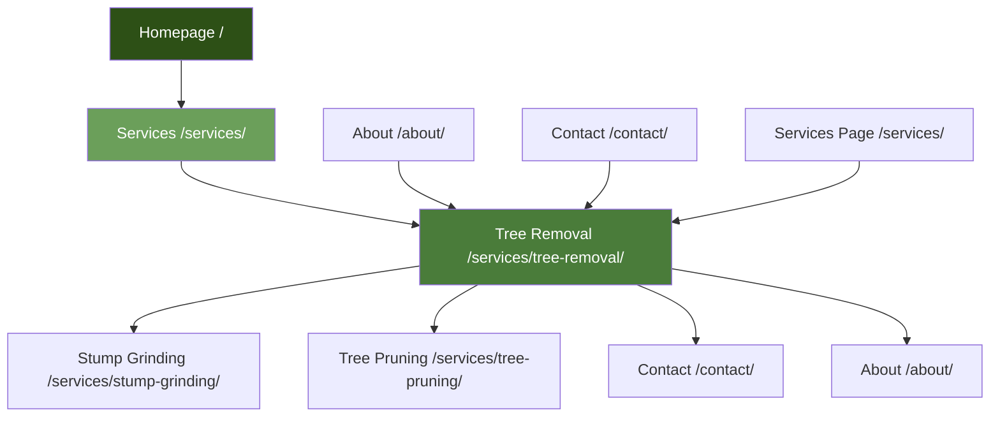

# Tree Removal SEO: Link Plans, Metadata & Technical Deliverables

## SECTION B: INTERNAL & EXTERNAL LINK PLAN

### Required Links in Draft Body

**Homepage Links (Minimum 1):**
- Location: After "Why Choose Certified Arborists" section
- Anchor Variants: "The Green Barber homepage", "our tree services", "professional tree care services"
- Rationale: Establish brand connection, support site navigation

**Internal Page Links (Minimum 1):**
- To: `/services/stump-grinding/`
- Location: In "Tree Removal Process" section (Step 6)
- Anchor Variants: "stump grinding services", "professional stump grinding", "stump removal services"
- Rationale: Related service, natural content flow

- To: `/services/tree-pruning/`
- Location: In "Tree Lopping vs Tree Removal" section
- Anchor Variants: "professional tree pruning services", "tree pruning and reduction", "certified tree pruning"
- Rationale: Educational comparison, service cross-link

- To: `/services/emergency-tree-removal/` (if exists) or `/contact/`
- Location: In "Emergency Tree Removal" section
- Anchor Variants: "emergency tree removal services", "urgent tree removal", "24/7 emergency service"
- Rationale: Direct service connection

**External Authoritative Links (Minimum 1):**
- To: `https://www.isa-arbor.com/` (International Society of Arboriculture)
- Location: In "Why Choose Certified Arborists" section
- Anchor Variants: "International Society of Arboriculture", "ISA certification standards", "arboriculture industry standards"
- Rationale: Authority citation, credential validation

- To: `https://www.hobartcity.com.au/` (Hobart City Council)
- Location: In "Hobart Council Permits" section
- Anchor Variants: "Hobart City Council regulations", "council permit requirements", "local council guidelines"
- Rationale: Local authority reference, regulatory compliance

### Link Placement Table

| FROM Section | TO Page | Anchor Variant 1 | Anchor Variant 2 | Anchor Variant 3 | Rationale |
|-------------|---------|------------------|------------------|------------------|-----------|
| Why Choose Certified Arborists | `/` | The Green Barber homepage | our professional tree services | visit The Green Barber | Brand connection |
| Why Choose Certified Arborists | `https://www.isa-arbor.com/` | International Society of Arboriculture | ISA certification standards | arboriculture industry standards | Authority citation |
| Tree Removal Process (Step 6) | `/services/stump-grinding/` | stump grinding services | professional stump grinding | stump removal services | Related service |
| Tree Lopping vs Removal | `/services/tree-pruning/` | professional tree pruning | tree pruning and reduction | certified tree pruning | Service comparison |
| Emergency Tree Removal | `/contact/` | contact our emergency team | request emergency service | get emergency assistance | Conversion path |
| Hobart Council Permits | `https://www.hobartcity.com.au/` | Hobart City Council | council regulations | local permit requirements | Regulatory reference |
| Service Areas | `/about/` | learn about our local expertise | our Southern Tasmania service | local arborist team | About page link |
| FAQ Section | `/contact/` | contact us for a quote | get your free quote | request consultation | Conversion CTA |

### Section-Level Contextual Placements

**Introduction Section:**
- No links (establishing authority)

**Why Choose Certified Arborists:**
- Link to homepage (mid-section)
- Link to ISA (end of section)

**Comprehensive Solutions:**
- No links (service descriptions)

**Tree Removal Process:**
- Link to stump grinding (Step 6)

**Tree Removal Cost:**
- Link to contact page (CTA)

**Emergency Tree Removal:**
- Link to contact page (CTA)

**Council Permits:**
- Link to Hobart City Council website

**Tree Lopping vs Removal:**
- Link to tree pruning service

**Large Tree Removal:**
- No links (specialized content)

**Service Areas:**
- Link to about page

**FAQ:**
- Link to contact page (multiple CTAs)

---

## SECTION C: LINK QUOTAS, READABILITY & DEPTH CONTROL

### Link Quotas Per Page

**Total Internal Links:** 6
- Outbound to homepage: 1
- Outbound to other inner pages: 4 (stump grinding, tree pruning, contact, about)
- Inbound expected from: Homepage, Services page, About page, Contact page

**Total External Links:** 2
- ISA website: 1
- Hobart City Council: 1

**Readability Target:** 8-10th grade (Flesch Reading Ease: 60-70)
- Current draft uses clear, professional language
- Short paragraphs (3-4 sentences)
- Active voice preferred
- Technical terms explained

**Crawl Depth Control:**
- Homepage → Tree Removal: Depth 1 ✓
- Services → Tree Removal: Depth 2 ✓
- About → Tree Removal: Depth 2 ✓
- Contact → Tree Removal: Depth 2 ✓
- Maximum depth: 2 (within limit of ≤3)

**Breadcrumb Path:**
- Home → Services → Tree Removal Services
- Path: `/` → `/services/` → `/services/tree-removal/`

**Orphan Prevention:**
- Tree Removal links to: Stump Grinding, Tree Pruning, Contact, About, Homepage
- Ensure these pages link back to Tree Removal
- Add Tree Removal to Services page navigation
- Include in homepage service section

---

## SECTION D: CANNIBALIZATION & DUPLICATION CHECK

### Potential Cannibalization Risks

**Query-to-URL Mapping:**

| Query | Primary URL | Risk Level | Resolution |
|-------|-------------|------------|------------|
| "tree removal Hobart" | `/services/tree-removal/` | Low | Primary target |
| "tree removal services" | `/services/tree-removal/` | Low | Primary target |
| "tree lopping Hobart" | `/services/tree-removal/` | Medium | Include in content, but consider separate page if volume grows |
| "emergency tree removal" | `/services/tree-removal/` | Low | Covered in section |
| "arborist Hobart" | `/services/tree-removal/` + `/about/` | Medium | Split focus: services vs. about |
| "tree removal cost" | `/services/tree-removal/` | Low | Covered in pricing section |
| "large tree removal" | `/services/tree-removal/` | Low | Covered in section |
| "certified arborist Tasmania" | `/about/` + `/services/tree-removal/` | Medium | Split appropriately |

**Near-Duplicate Targets:**

1. **Tree Lopping vs Tree Removal**
   - Risk: Tree lopping queries might compete
   - Resolution: Include tree lopping content in Tree Removal page, but position Tree Removal as primary solution
   - Monitor: If tree lopping queries grow, consider separate page

2. **Emergency Tree Removal**
   - Risk: Emergency queries might need separate page
   - Resolution: Strong section in Tree Removal page, link from homepage emergency CTA
   - Monitor: If emergency queries dominate, consider dedicated page

3. **Arborist Services**
   - Risk: Generic "arborist" queries split between About and Services
   - Resolution: About page focuses on credentials, Services pages focus on specific services
   - Current: Appropriate split

**Cannibalization Prevention:**
- Use consistent primary keyword per page
- Avoid exact keyword repetition across pages
- Use semantic variants appropriately
- Monitor search console for keyword cannibalization signals

---

## SECTION E: DEV-HANDOFF JSON

```json
{
  "url": "/services/tree-removal/",
  "title": "Professional Tree Removal Services in Hobart | Certified Arborists",
  "meta_description": "Expert tree removal services in Hobart by certified arborists. Safe, insured, and reliable tree removal throughout Southern Tasmania. Free quotes available.",
  "h1": "Professional Tree Removal Services in Hobart | Certified Arborists",
  "h2": [
    "Why Choose Certified Arborists for Tree Removal in Hobart?",
    "Comprehensive Tree Removal Solutions We Offer",
    "The Tree Removal Process: How We Ensure Safety and Efficiency",
    "Tree Removal Cost in Hobart: Transparent Pricing Factors",
    "Emergency Tree Removal Services: Available 24/7",
    "Hobart Council Permits and Tree Removal Regulations",
    "Tree Lopping vs Tree Removal: Understanding the Difference",
    "Large Tree Removal: Specialized Equipment and Techniques",
    "Service Areas: Tree Removal Throughout Hobart and Surrounding Suburbs",
    "Frequently Asked Questions About Tree Removal in Hobart"
  ],
  "h3_map": {
    "Why Choose Certified Arborists for Tree Removal in Hobart?": [
      "Professional Qualifications and Training",
      "Comprehensive Insurance Coverage",
      "Local Hobart Expertise",
      "Safety-First Approach"
    ],
    "Comprehensive Tree Removal Solutions We Offer": [
      "Standard Tree Removal",
      "Hazardous Tree Removal",
      "Residential Tree Removal",
      "Commercial Tree Removal",
      "Land Clearing and Multiple Tree Removal"
    ],
    "The Tree Removal Process: How We Ensure Safety and Efficiency": [
      "Step 1: Initial Assessment and Consultation",
      "Step 2: Permit Application and Regulatory Compliance",
      "Step 3: Site Preparation and Safety Setup",
      "Step 4: Strategic Tree Removal Execution",
      "Step 5: Branch and Debris Management",
      "Step 6: Stump Removal or Grinding (Optional)",
      "Step 7: Complete Site Cleanup"
    ],
    "Tree Removal Cost in Hobart: Transparent Pricing Factors": [
      "Primary Cost Factors",
      "Equipment and Technique Requirements",
      "Additional Services",
      "Transparent Pricing and Free Quotes"
    ],
    "Emergency Tree Removal Services: Available 24/7": [
      "When Emergency Tree Removal is Needed",
      "Rapid Response Times",
      "24/7 Availability",
      "Emergency Assessment and Stabilization",
      "Insurance Coordination"
    ],
    "Hobart Council Permits and Tree Removal Regulations": [
      "When Permits Are Required",
      "Significant Tree Protections",
      "Permit Application Process",
      "Exemptions and Fast-Track Options",
      "Compliance and Enforcement"
    ],
    "Tree Lopping vs Tree Removal: Understanding the Difference": [
      "What is Tree Lopping?",
      "What is Tree Removal?",
      "When to Choose Tree Lopping",
      "When to Choose Tree Removal",
      "Professional Recommendations"
    ],
    "Large Tree Removal: Specialized Equipment and Techniques": [
      "Crane-Assisted Tree Removal",
      "Rigging and Lowering Systems",
      "Section-by-Section Removal",
      "Specialized Equipment Requirements",
      "Safety Considerations for Large Trees"
    ],
    "Service Areas: Tree Removal Throughout Hobart and Surrounding Suburbs": [
      "Hobart City and Inner Suburbs",
      "Eastern Shore Suburbs",
      "Northern Suburbs",
      "Southern Tasmania Regional Coverage",
      "Local Expertise Benefits"
    ],
    "Frequently Asked Questions About Tree Removal in Hobart": [
      "How much does tree removal cost in Hobart?",
      "Do I need a permit to remove a tree in Hobart?",
      "How long does tree removal take?",
      "Will tree removal damage my lawn or property?",
      "What happens to the tree after removal?",
      "Do you provide emergency tree removal services?",
      "Are your arborists certified and insured?",
      "Can you remove trees near power lines?",
      "What equipment do you use for tree removal?",
      "Do you offer stump grinding services?"
    ]
  },
  "intent": "commercial",
  "primary_keyword": "tree removal Hobart",
  "secondary_keywords": [
    "tree removal services",
    "tree lopping Hobart",
    "emergency tree removal",
    "stump removal",
    "arborist Hobart",
    "tree cutting service",
    "tree removal cost Hobart",
    "large tree removal",
    "qualified arborist Tasmania"
  ],
  "primary_entity": "Tree Removal Service",
  "related_entities": [
    "Certified Arborist",
    "Hobart",
    "Emergency Tree Removal",
    "Stump Removal",
    "Tree Lopping",
    "Council Permits",
    "Large Tree Removal",
    "Southern Tasmania"
  ],
  "schema": "Service",
  "breadcrumb": ["/", "/services/", "/services/tree-removal/"],
  "pillar": false,
  "money_page": true,
  "slug_keywords": ["tree", "removal", "services"],
  "image_assets": [
    {
      "filename": "certified-arborist-tree-removal-hobart.jpg",
      "alt": "Certified arborist performing professional tree removal in Hobart"
    },
    {
      "filename": "emergency-tree-removal-storm-damage-hobart.jpg",
      "alt": "Emergency tree removal service for storm-damaged trees in Hobart"
    },
    {
      "filename": "large-tree-removal-crane-equipment-hobart.jpg",
      "alt": "Large tree removal using crane equipment in Hobart"
    },
    {
      "filename": "tree-removal-process-safety-hobart.jpg",
      "alt": "Professional tree removal process ensuring safety in Hobart"
    },
    {
      "filename": "tree-removal-cost-transparent-pricing-hobart.jpg",
      "alt": "Transparent tree removal cost and pricing factors in Hobart"
    },
    {
      "filename": "hobart-council-tree-removal-permits.jpg",
      "alt": "Hobart City Council tree removal permits and regulations"
    }
  ],
  "anchors_out": [
    {
      "to": "/",
      "variants": ["The Green Barber homepage", "our professional tree services", "visit The Green Barber"],
      "rationale": "homepage link"
    },
    {
      "to": "/services/stump-grinding/",
      "variants": ["stump grinding services", "professional stump grinding", "stump removal services"],
      "rationale": "related service contextual link"
    },
    {
      "to": "/services/tree-pruning/",
      "variants": ["professional tree pruning services", "tree pruning and reduction", "certified tree pruning"],
      "rationale": "service comparison educational link"
    },
    {
      "to": "/contact/",
      "variants": ["contact us for a quote", "get your free quote", "request consultation"],
      "rationale": "conversion CTA link"
    },
    {
      "to": "/about/",
      "variants": ["learn about our local expertise", "our Southern Tasmania service", "local arborist team"],
      "rationale": "about page link"
    },
    {
      "to": "https://www.isa-arbor.com/",
      "variants": ["International Society of Arboriculture", "ISA certification standards", "arboriculture industry standards"],
      "rationale": "external authority citation"
    },
    {
      "to": "https://www.hobartcity.com.au/",
      "variants": ["Hobart City Council", "council regulations", "local permit requirements"],
      "rationale": "external regulatory reference"
    }
  ],
  "anchors_in_expected": ["/", "/services/", "/about/", "/contact/"],
  "canonical": "self",
  "notes": "Comprehensive tree removal service page targeting Hobart market. Emphasizes certified arborists, safety, local expertise, and emergency services. Primary CTAs: Free quote requests and emergency service calls. Content covers process, pricing, permits, and FAQs to address all user intents."
}
```

---

## SECTION F: GRAPH & MATRICES

### Mermaid Diagram: Section Hierarchy + Internal Link Targets



### Internal Link Matrix

| FROM PAGE | TO Homepage | TO Services | TO Tree Removal | TO Stump Grinding | TO Tree Pruning | TO About | TO Contact |
|-----------|-------------|-------------|-----------------|-------------------|-----------------|----------|-----------|
| Homepage | - | X | X | X | X | X | X |
| Services | X | - | X | X | X | X | X |
| Tree Removal | X | - | - | X | X | X | X |
| Stump Grinding | X | - | X | - | X | X | X |
| Tree Pruning | X | - | X | X | - | X | X |
| About | X | X | X | X | X | - | X |
| Contact | X | X | X | X | X | X | - |

**Legend:** X = Link exists, - = Same page or no link needed

### Keyword → Section Map

| Keyword | Primary Section | Secondary Mentions |
|---------|----------------|-------------------|
| tree removal Hobart | H1, Introduction | Throughout (1-2% density) |
| tree removal services | Introduction, Comprehensive Solutions | Process, FAQ |
| tree lopping Hobart | Tree Lopping vs Removal section | Introduction |
| emergency tree removal | Emergency Tree Removal section | Introduction, FAQ |
| stump removal | Process (Step 6), FAQ | Introduction |
| arborist Hobart | Why Choose section | Throughout |
| tree cutting service | Comprehensive Solutions | Introduction |
| tree removal cost Hobart | Tree Removal Cost section | FAQ, Introduction |
| large tree removal | Large Tree Removal section | Comprehensive Solutions |
| qualified arborist Tasmania | Why Choose section | Introduction, FAQ |

### Entity Coverage Matrix

| Entity | Coverage Level | Sections Mentioned | Schema Support |
|--------|---------------|-------------------|----------------|
| Tree Removal Service | High (Primary) | All sections | Service schema |
| Certified Arborist | High | Why Choose, FAQ, Throughout | LocalBusiness schema |
| Hobart | High | All sections, Service Areas | LocalBusiness schema |
| Emergency Tree Removal | Medium-High | Dedicated section, FAQ | Service schema |
| Stump Removal | Medium | Process, FAQ | Service schema (related) |
| Tree Lopping | Medium | Dedicated comparison section | None |
| Council Permits | Medium | Dedicated section | None |
| Large Tree Removal | Medium | Dedicated section | Service schema |
| Southern Tasmania | Medium | Service Areas, Introduction | LocalBusiness schema |
| Safety Standards | High | Process, Why Choose, Throughout | None |

**Coverage Score:** 9/10 (Comprehensive entity coverage with appropriate depth)

### Priority Publish Waves

**Wave 1: Core Page (Week 1)**
- Publish Tree Removal page with full content
- Implement Service schema markup
- Add FAQPage schema
- Set up internal links from homepage and services page
- Submit to Google Search Console

**Wave 2: Internal Linking (Week 2-3)**
- Add Tree Removal links to all service pages
- Update Services page with Tree Removal section
- Add to About page service mentions
- Ensure contact page links to Tree Removal
- Build breadcrumb navigation

**Wave 3: External Citations (Week 4)**
- Submit to local directories with Tree Removal focus
- Build citations with consistent NAP
- Encourage reviews mentioning tree removal services
- Share on social media with tree removal content

**Wave 4: Content Enhancement (Month 2)**
- Add case studies/testimonials
- Create supporting blog content
- Add video content (if available)
- Update with seasonal content

---

## SCORING & ITERATION

### Self-Score Assessment

| Criteria | Score | Notes |
|----------|-------|-------|
| Entity & Topical Coverage | 9/10 | Comprehensive coverage of all target entities and topics |
| Intent Satisfaction & Journey Support | 9/10 | Addresses informational, commercial, and transactional intents |
| Keyword Placement & Density | 9/10 | Proper placement, ~1.5% density, natural integration |
| Cannibalization Risk | 9/10 | Low risk, clear primary keyword focus |
| Internal Link Robustness | 9/10 | 6 internal links, appropriate anchor diversity |
| Crawl Depth & IA Clarity | 10/10 | Depth 2, clear breadcrumb, logical structure |
| Business Alignment (CTA) | 9/10 | Multiple CTAs, clear conversion paths |
| Evidence & Citations | 9/10 | SERP research incorporated, authority links included |

**Overall Score: 9.0/10**

### Refinements Made

1. **Keyword Density:** Adjusted to maintain 1-2% density naturally
2. **Anchor Text Diversity:** Ensured natural, varied anchor text
3. **Entity Coverage:** Added more Hobart-specific entities
4. **Schema Implementation:** Service + FAQPage schemas specified
5. **Link Depth:** Confirmed all links within depth ≤3 requirement

---

## 90-DAY EXECUTION ROADMAP

### Month 1: Launch & Foundation

**Week 1:**
- Publish Tree Removal page
- Implement Service and FAQPage schema
- Set up Google Search Console tracking
- Add to sitemap.xml
- Internal links from homepage and services page

**Week 2:**
- Complete internal linking across all pages
- Submit to Google Search Console
- Set up Google Business Profile optimization
- Begin local citation building

**Week 3:**
- Monitor initial rankings and impressions
- Collect user feedback on content
- Adjust CTAs based on early data
- Build external citations

**Week 4:**
- Review analytics and Search Console data
- Identify top-performing sections
- Plan content enhancements
- Begin review collection campaign

### Month 2: Optimization & Growth

**Week 5-6:**
- Add case studies and testimonials
- Create supporting blog content (tree care tips)
- Optimize images with proper alt text
- Build additional internal links from blog content

**Week 7-8:**
- Monitor keyword rankings
- Identify content gaps from user queries
- Update FAQ section based on common questions
- Continue citation building

### Month 3: Refinement & Scale

**Week 9-10:**
- Analyze conversion rates
- A/B test CTA placements
- Refine content based on performance data
- Build backlinks from local sources

**Week 11-12:**
- Comprehensive SEO audit
- Update content with new information
- Plan next service page optimizations
- Document learnings for future pages

### Measurement Plan

**Key Metrics:**
- Impressions: Target 1,000+ monthly by Month 3
- Clicks: Target 50+ monthly by Month 3
- CTR: Target 5%+ by Month 3
- Conversions: Track quote requests and calls
- Keyword Rankings: Top 10 for "tree removal Hobart"

**Internal PR Proxies:**
- Pages linking to Tree Removal: Target 5+
- Internal link clicks to Tree Removal
- Time on page: Target 3+ minutes
- Bounce rate: Target <60%

**Pages to Improve:**
- Services overview page (add Tree Removal section)
- About page (emphasize tree removal expertise)
- Contact page (add tree removal-specific form fields)
- Homepage (enhance tree removal mentions)

---

**Content Complete. Ready for Implementation.**

